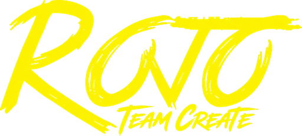

<div align="center">
    <a href="https://github.com/Developer-One-Studios/rojo-team-create"></a>
</div>

<div>&nbsp;</div>

<div align="center">
    <a href="https://github.com/Developer-One-Studios/rojo-team-create/actions"></a>
    <a href="https://github.com/Developer-One-Studios/rojo-team-create/releases/latest"></a>
    <a href="https://rojo.space/docs"></a>
</div>

<hr />

**Rojo Team Create** is [Rojo](https://github.com/rojo-rbx/rojo) with a Studio plugin built for Team Create: everyone syncs their own code into the same place without overwriting each other. Outside Team Create it works exactly like Rojo, and the [Rojo docs](https://rojo.space/docs) still apply.

## How it works

In Team Create, the plugin **stages** your changes instead of writing them into the place.

- **Staged** changes stay on your machine and don't replicate to anyone else.
- **Play** in the plugin panel starts a local playtest with your staged changes. Studio's own Play button only uses deployed code.
- **Deploy** writes your staged changes into the place, so they save, replicate to everyone, and are used when you publish or Team Test.

Click the staged count in the panel to see what would change. Staging can be turned off with the **Stage Changes in Team Create** setting.

## Installing

1. Download `RojoTeamCreate.rbxm` from the [latest release](https://github.com/Developer-One-Studios/rojo-team-create/releases/latest) and put it in Studio's **Plugins > Plugins Folder**.
2. Remove or disable the regular Rojo plugin in your own Studio.
3. Use the regular Rojo server, version 7.7 or newer (`rokit add rojo-rbx/rojo`), and run `rojo serve`.

## Runtime loader

Each place can opt in to the runtime loader with the **Set up** button in the Rojo panel. Your staged changes then never leave your machine, and Studio's own Play button tests them.

- Rojo-managed scripts are deployed turned off, and a small `ROJO_TEAM_CREATE_LOADER` script in ServerScriptService turns them on when a server starts.
- Your staged changes are kept in a Camera in ServerStorage, which Team Create doesn't replicate. The loader swaps them in, so they're only in playtests you start yourself.
- The place needs the loader to start its scripts. If it's deleted, press **Set up** again to add it back. To stop using it, run *Rojo: Remove Runtime Loader*, which also turns the scripts back on.

## Things to know

- **Without the runtime loader, Rojo's Play briefly shares your changes.** Studio starts game scripts before plugins load, so the plugin writes your staged changes into the place while the playtest starts (about 4–5 seconds), then reverts them.
- **While staging, two-way sync is off and the sync lock isn't used**, so several people can be connected at once.

## Working with people on the regular Rojo plugin

Both plugins work in the same place, but only Rojo Team Create users get staging. Regular Rojo syncs go live for everyone right away, and they can overwrite Rojo Team Create deploys to the same scripts (and the other way around). Regular Rojo users should keep two-way sync off. For full protection, the whole team should use Rojo Team Create.

## Building from source

```bash
git submodule update --init --recursive
rojo build plugin.project.json --plugin RojoTeamCreate.rbxm
```

## License

Based on [Rojo](https://github.com/rojo-rbx/rojo) and available under the Mozilla Public License 2.0. See [LICENSE.txt](LICENSE.txt).
